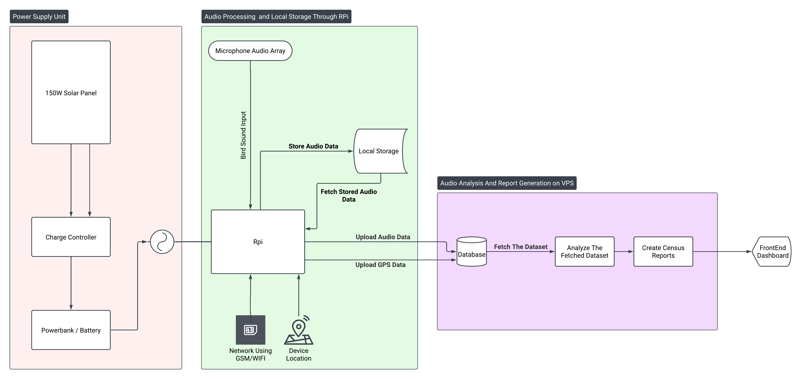

# Janawar Census - Bird Acoustic Census System

## 🐦 Problem Statement

Bird species across the **Wular**, **Hygam**, and **Hokersar** wetlands (designated **Ramsar sites**) in Jammu & Kashmir have shown a **drastic population decline**:

- **Wular Lake**: 1.2 lakh birds (2020) ➝ 707 birds (2021)
- **Hokersar Wetlands**: 4.8 lakh birds (2020) ➝ 65,000 birds (2021)
- **Hygam Wetlands**: Notable long-term decline in migratory bird inflow

**Root Causes**:
- Habitat destruction
- Human encroachment
- Pollution

These factors are severely impacting **breeding**, **nesting grounds**, and the overall **ecological balance**.

---

## 💡 Proposed Solution

The **Janawar Census** is an **AI-powered, acoustic-based bird monitoring system** that uses a distributed network of **solar-powered Raspberry Pi devices** to record, identify, and analyze bird calls in real-time.

### Features:

- 📡 **Non-intrusive**, real-time, acoustic monitoring
- 🕊️ Species identification using **BirdNET**
- 🔴 Alerts for endangered species
- 📊 Web dashboard for data visualization and trends
- 🧭 Geo-tagged acoustic data for conservation planning

---

## 🎯 Objectives

- Enable **non-invasive**, round-the-clock wildlife monitoring
- Generate **real-time data and alerts** through a centralized dashboard
- Detect **endangered or rare bird species**
- Aid **policy-makers and conservationists** in ecological restoration

---

## 🛠️ System Components

### 📦 Hardware

| S.No | Component                                | Quantity | Purpose                                          |
|------|------------------------------------------|----------|--------------------------------------------------|
| 1    | Raspberry Pi 4 Model B (4GB)             | 1        | Main processing unit                             |
| 2    | ReSpeaker USB Microphone Array           | 1        | Directional bird sound capture                   |
| 3    | SIM7600E-H 4G HAT for Raspberry Pi       | 1        | GSM-based cloud connectivity                     |
| 4    | NEO-6M GPS Module                        | 1        | Location tagging                                 |
| 5    | Portronics USB Extension Cable (1.5m)    | 1        | Microphone positioning away from Pi              |
| 6    | Xiaomi 4i 20000mAh Power Bank            | 1        | USB-based power supply                           |
| 7    | Zeromeco Solar Panel Charge Controller   | 1        | Manages solar charging                           |
| 8    | Solar Universe 150W Solar Panel          | 1        | Off-grid solar power supply                      |
| 9    | External 256GB SSD                       | 1        | Local audio/data storage                         |

---

## 🧩 Software Stack

- 🎙️ **Audio Recording**: `ffmpeg`, `arecord`
- 🐦 **Bird Species Identification**: [BirdNET Analyzer](https://birdnet.cornell.edu/) ([GitHub](https://github.com/birdnet-team/BirdNET-Analyzer))
- 🐍 **Data Processing Scripts**: Python
- 🌐 **Backend API**: FastAPI
- 💻 **Frontend Dashboard**: Next.js
- 🗄️ **Database**: PostgreSQL

---

## 🔄 System Workflow



### Edge Device Workflow

1. **Recording**: Device records ambient bird sounds using microphone arrays.
2. **Processing**: Audio analyzed using BirdNET for species identification.
3. **Location Tagging**: GPS data attached to each acoustic event.
4. **Data Upload**: Processed results uploaded via GSM/4G to central server.

### Backend Workflow

1. **Data Upload**: Processed results uploaded via GSM/4G to central server.
2. **Dashboard Visualization**: Real-time graphs, alerts, and trends are shown.
3. **Endangered Species Alert**: Sends notifications on rare species detection.

---

## 🚀 Getting Started

### Prerequisites

- Python 3.9+
- Node.js 18+
- PostgreSQL 13+
- Docker (optional, for containerized deployment)

### Installation

1. **Clone the repository**
   ```bash
   git clone https://github.com/eddy7896/JanawarCensus.git
   cd JanawarCensus
   ```

2. **Set up the backend**
   ```bash
   cd backend
   python -m venv venv
   source venv/bin/activate  # On Windows: .\venv\Scripts\activate
   pip install -r requirements.txt
   ```

3. **Set up the frontend**
   ```bash
   cd ../frontend-app
   npm install
   ```

4. **Set up environment variables**
   - Copy `.env.example` to `.env` in both `backend` and `frontend-app` directories
   - Update the environment variables as needed

## 🛠 Development

### Running the backend
```bash
cd backend
uvicorn app.main:app --reload
```

### Running the frontend
```bash
cd frontend-app
npm run dev
```

### Running with Docker
```bash
docker-compose up --build
```

## 🤝 Contributing

We welcome contributions! Please follow these steps:

1. Fork the repository
2. Create a feature branch (`git checkout -b feature/AmazingFeature`)
3. Commit your changes (`git commit -m 'Add some AmazingFeature'`)
4. Push to the branch (`git push origin feature/AmazingFeature`)
5. Open a Pull Request

## 📝 License

This project is licensed under the MIT License - see the [LICENSE](LICENSE) file for details.

## 📌 References

1. [Ramsar Sites Data - Wetlands of India](https://101reporters.com/article/environment/Birds_dwindle_in_Srinagars_Hokersar_wetland_birdwatching_community_concerned)
2. [Asian Waterbird Census in Jammu and Kashmir (2015–2021)](https://www.researchgate.net/publication/359209512_Asian_Waterbird_Census_in_Jammu_and_Kashmir_2015-21_-_Spatial_attributes_and_trend_analysis)
3. [BirdNET](https://birdnet.cornell.edu/)
4. [BirdNET Analyzer](https://github.com/birdnet-team/BirdNET-Analyzer)

---

## 📂 Repository Structure

```
janawar-census/
├── backend/                  # FastAPI backend application
│   ├── app/                  # Main application package
│   │   ├── api/              # API endpoints and routes
│   │   ├── core/             # Core functionality (config, security, etc.)
│   │   ├── db/               # Database configuration and models
│   │   ├── models/           # SQLAlchemy models
│   │   ├── schemas/          # Pydantic models
│   │   ├── services/         # Business logic and services
│   │   └── main.py           # Application entry point
│   ├── alembic/              # Database migrations
│   └── requirements.txt      # Python dependencies
│
├── db/                       # Database initialization scripts
│   └── init.sql              # Database schema and initial data
│
├── edge-device/              # Edge device implementation (Raspberry Pi)
│   ├── audio/                # Audio recording and processing
│   ├── gps/                  # GPS tracking functionality
│   ├── upload/               # Data upload scripts
│   └── requirements.txt      # Python dependencies for edge device
│
├── frontend-app/             # Next.js frontend application
│   ├── app/                  # App router pages and layouts
│   ├── components/           # Reusable UI components
│   ├── lib/                  # Utilities and services
│   ├── public/               # Static assets
│   └── package.json          # Frontend dependencies
│
├── images/                   # Project images and diagrams
│   └── system_workflow.png   # System architecture diagram
│
├── scripts/                  # Development and utility scripts
│   └── database/             # Database management scripts
│
├── .env.example              # Example environment variables
├── .gitignore               # Git ignore rules
├── docker-compose.yml        # Docker Compose configuration
└── README.md                # Project documentation
└── README.md                # Project documentation
```

## 🛠️ System Designed and Developed By

- **Name**: Mohammad Faheem
- **Email**: faheemfarooq3@gmail.com
- **GitHub**: [eddy7896](https://github.com/eddy7896)

---
